# Class diagram

Updated at the end of every milestone (DECISIONS.md D1). Shows the classes that exist in
`src/main/java` now, not the planned design; for the planned design see `ARCHITECTURE.md`.
Accessors that only return a field are omitted; every domain and config class is immutable
(private final fields, static factory or builder, no setters).

**As of:** M5: Slurm executor (code complete; the recordings from Explorer are pending).

## app: entry point, CLI commands, orchestration

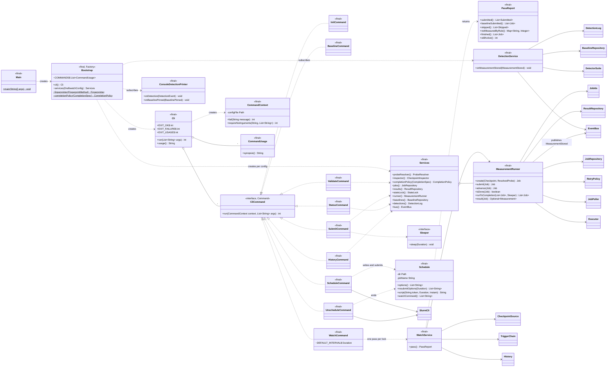

## config: YAML to validated config, canonical hashing

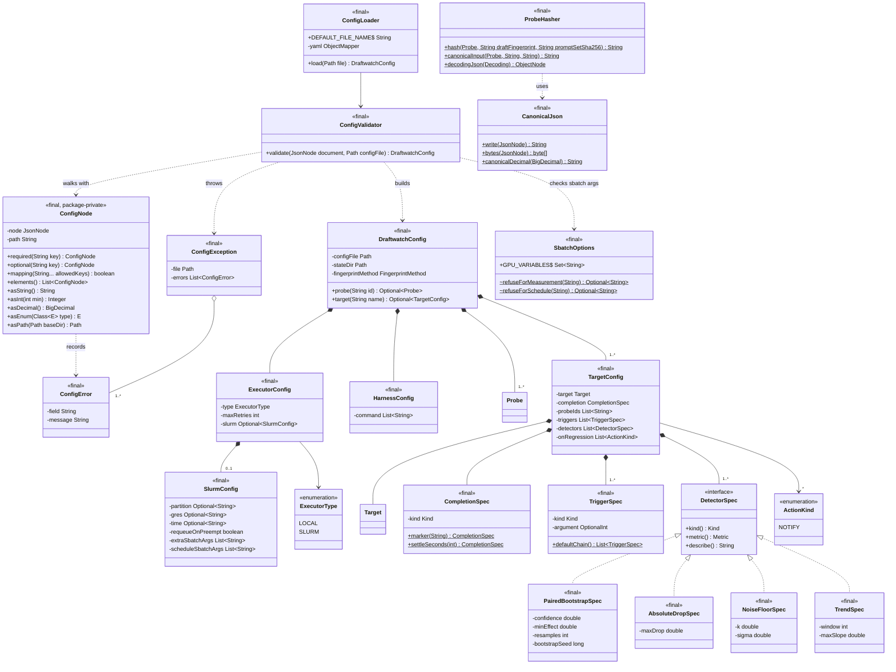

## domain: immutable domain classes

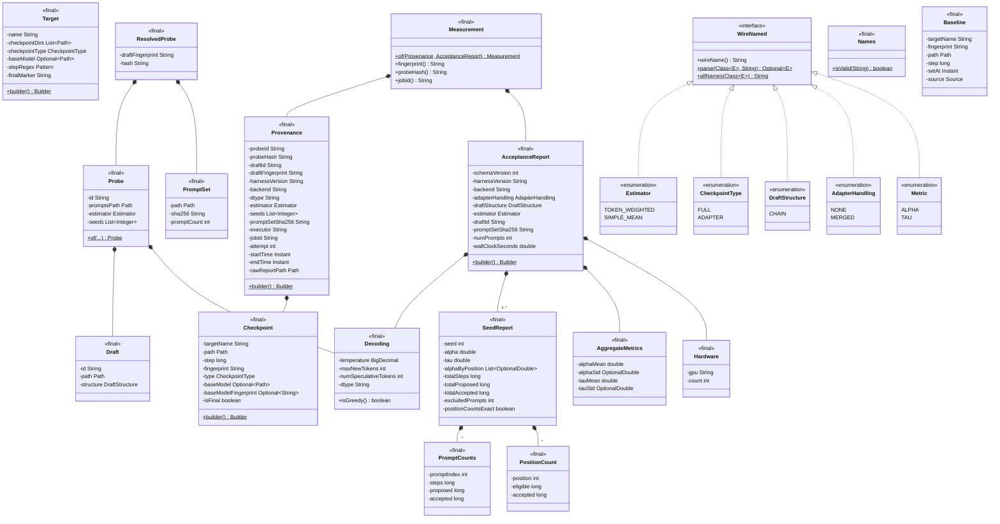

## fingerprint: content fingerprints

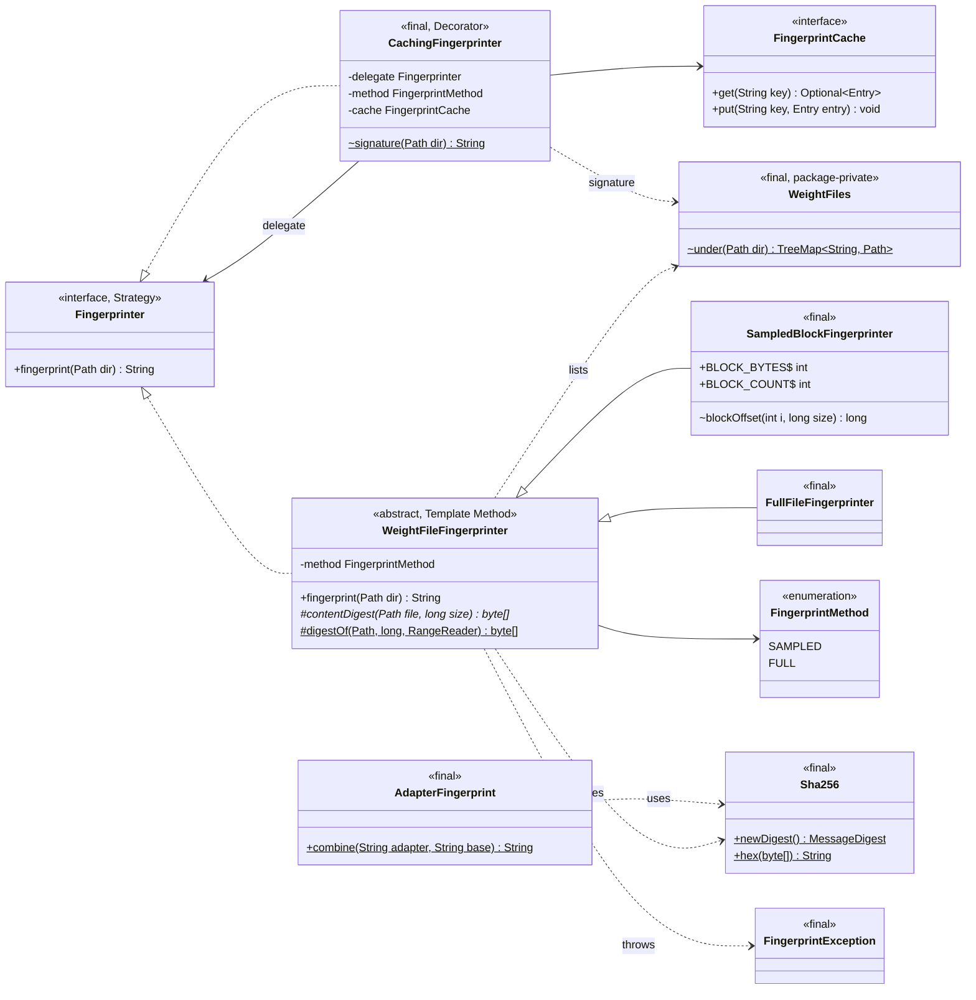

## discovery: checkpoint directories

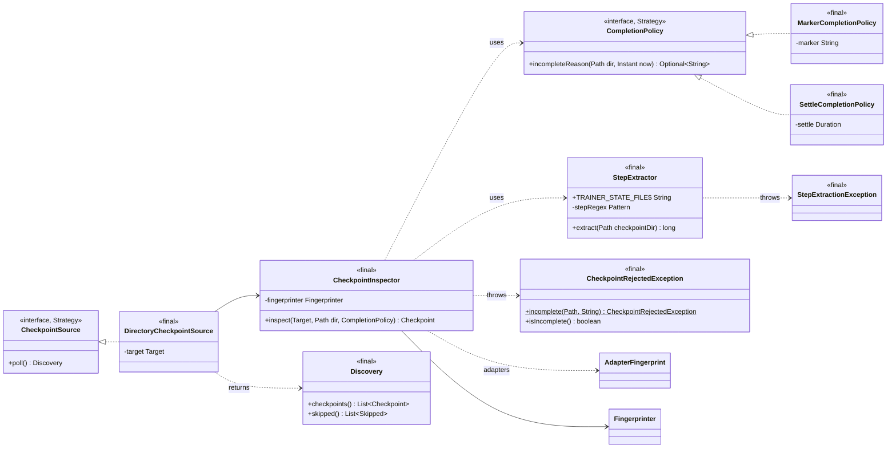

## harness: the measurement contract

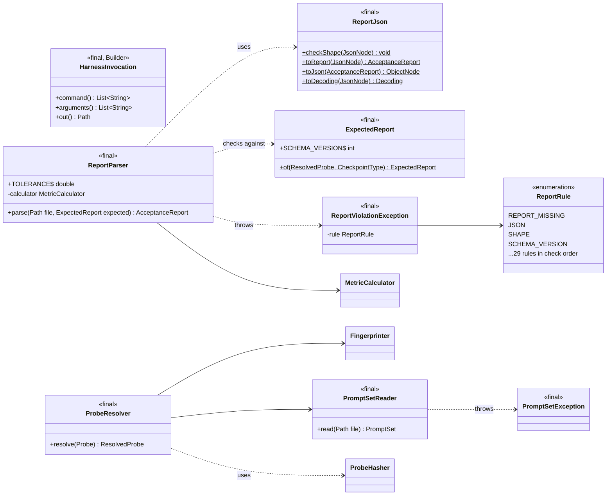

## stats: metrics

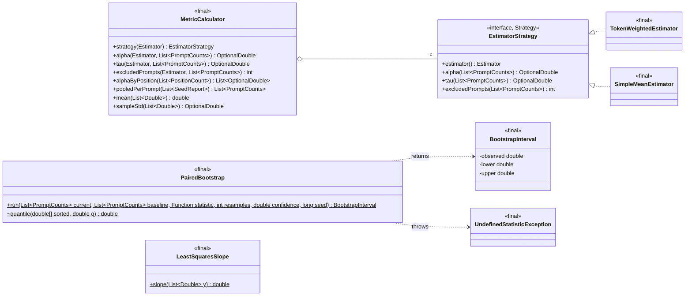

## exec: jobs and executors

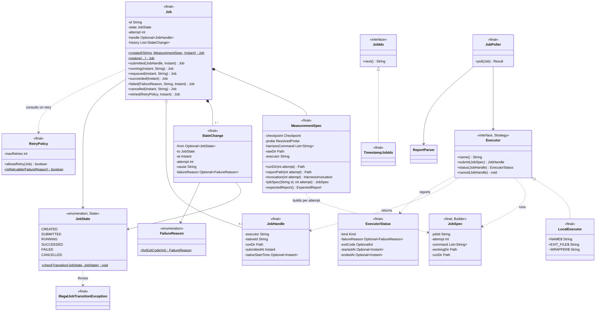

`ExecutorStatus.Kind` is `QUEUED`, `RUNNING`, `EXITED`, `LOST`, `FAILED` (with a reason),
`CANCELLED`, or `UNRESOLVED` (the poll changes nothing; DECISIONS.md D60).

## exec.slurm: the Slurm executor

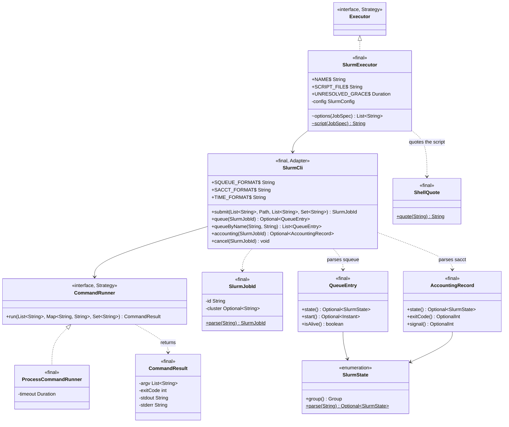

Test doubles: `ReplayCommandRunner` answers with recorded or synthetic fixture output
(`fixtures/slurm/`), and `FakeSlurm` simulates a cluster that runs batch scripts locally.

## store: the state directory

```mermaid
classDiagram
  direction TB

  class JobRepository {
    <<interface, Repository>>
    +save(Job) void
    +find(String id) Optional~Job~
    +all() List~Job~
  }
  class ResultRepository {
    <<interface, Repository>>
    +append(Measurement) void
    +history(String target, String probeHash) List~Measurement~
    +find(String fingerprint, String probeHash) List~Measurement~
    +latest(String fingerprint, String probeHash) Optional~Measurement~
    +locate(Measurement) Path
  }
  class FileJobRepository { <<final>> }
  class FileResultRepository { <<final>> }
  class BaselineRepository {
    <<interface, Repository>>
    +get(String target) Optional~Baseline~
    +set(Baseline) void
  }
  class FileBaselineRepository { <<final>> }
  class DetectionLog {
    <<interface, Repository>>
    +append(DetectionRecord) void
    +all() List~DetectionRecord~
  }
  class FileDetectionLog { <<final>> }
  class FileFingerprintCache {
    <<final>>
    +FILE$ String
  }
  class DetectionRecord {
    <<final>>
    -kind String
    -subject DetectionSubject
    -detector Optional~String~
    -observed OptionalDouble
    -threshold OptionalDouble
    -baselineJobId Optional~String~
    -explanation String
    +of(DetectionEvent)$ DetectionRecord
  }
  class JsonCodec {
    <<final>>
    +jobJson(Job) ObjectNode
    +job(JsonNode) Job
    +measurementJson(Measurement) ObjectNode
    +measurement(JsonNode) Measurement
  }
  class AtomicFiles {
    <<final>>
    +write(Path, byte[])$ void
    +writeNew(Path, byte[])$ void
  }
  class StateLock {
    <<final>>
    +LOCK_FILE$ String
    +acquire(Path stateDir, String command) Held
    +holder(Path stateDir) Optional~LockHolder~
  }
  class Held {
    <<final>>
    +close() void
  }
  class LockHolder {
    <<final>>
    -host String
    -pid long
    -pidStart Optional~Instant~
    -slurmJobId Optional~String~
    -acquiredAt Instant
    -command String
  }
  class HostIdentity {
    <<interface>>
    +hostname() String
    +pid() long
    +processStart() Optional~Instant~
    +slurmJobId() Optional~String~
  }
  class ProcessTable {
    <<interface>>
    +isAlive(long pid, Optional~Instant~ start) boolean
  }
  class SlurmJobTable {
    <<interface>>
    +isAlive(String slurmJobId) boolean
  }
  class SqueueJobTable { <<final>> }
  class SystemHostIdentity { <<final>> }
  class SystemProcessTable { <<final>> }
  class StoreException { <<final>> }
  class StateLockException { <<final>> }

  JobRepository <|.. FileJobRepository
  BaselineRepository <|.. FileBaselineRepository
  DetectionLog <|.. FileDetectionLog
  FingerprintCache <|.. FileFingerprintCache
  DetectionLog ..> DetectionRecord
  ResultRepository <|.. FileResultRepository
  FileJobRepository --> JsonCodec
  FileResultRepository --> JsonCodec
  FileJobRepository ..> AtomicFiles : writes with
  FileResultRepository ..> AtomicFiles : writes with
  StateLock ..> Held : returns
  StateLock ..> LockHolder : records
  StateLock --> HostIdentity
  StateLock --> ProcessTable
  StateLock --> SlurmJobTable
  SlurmJobTable <|.. SqueueJobTable
  SqueueJobTable --> SlurmCli
  HostIdentity <|.. SystemHostIdentity
  ProcessTable <|.. SystemProcessTable
  StateLock ..> StateLockException : throws
  FileResultRepository ..> StoreException : throws
```

Test doubles (in `src/test`) give each interface its second implementation: `FakeExecutor`,
`ScriptedExecutor`, `InMemoryJobRepository`, `InMemoryResultRepository`,
`InMemoryBaselineRepository`, `InMemoryDetectionLog`, and test-local `HostIdentity`,
`ProcessTable`, `SlurmJobTable`, `Notifier`, `RegressionDetector`, `History`, and counting
`Fingerprinter` fakes.

## trigger: which checkpoints get measured

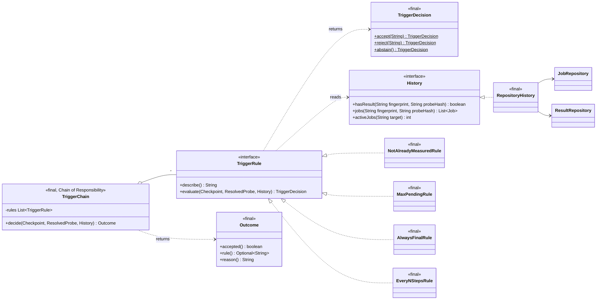

## detect: regression detection

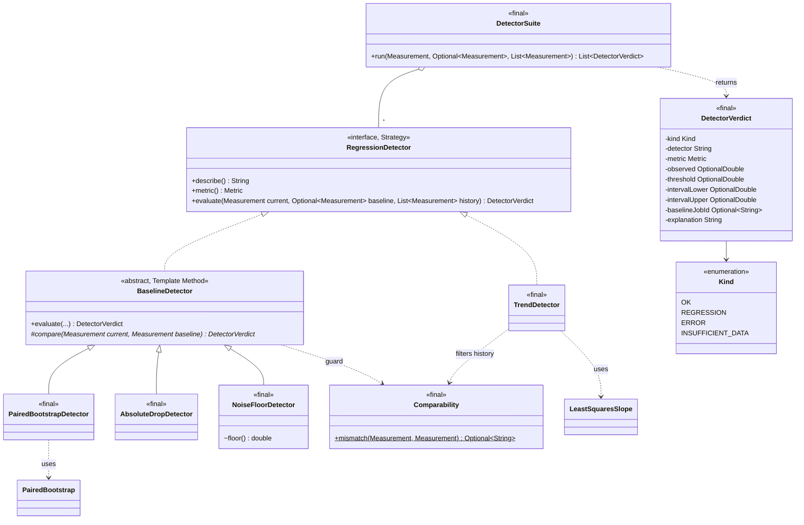

## events: the event bus

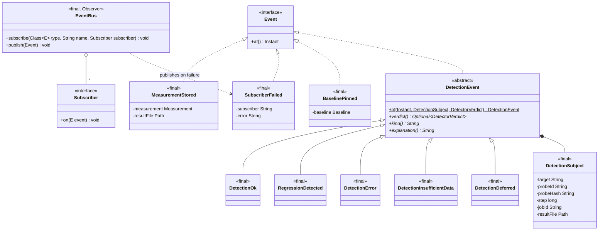

## notify and action: alerts

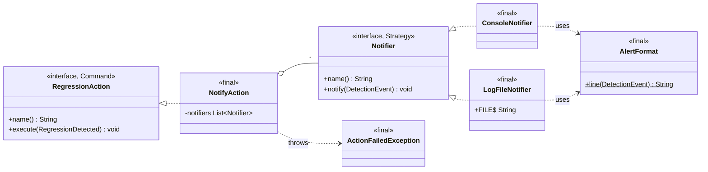

## Packages

| Package | Populated in |
|---|---|
| `app`, `config`, `domain`, `fingerprint` | M0–M2 |
| `discovery` | M1 (step extraction), M2 (completion policies, inspector), M4 (checkpoint sources) |
| `harness`, `exec`, `store`, `stats` | M1–M2 |
| `detect`, `events`, `notify`, `action` | M3 |
| `trigger` | M4 |
| `exec.slurm` | M5 |
| `report` | M6 |
