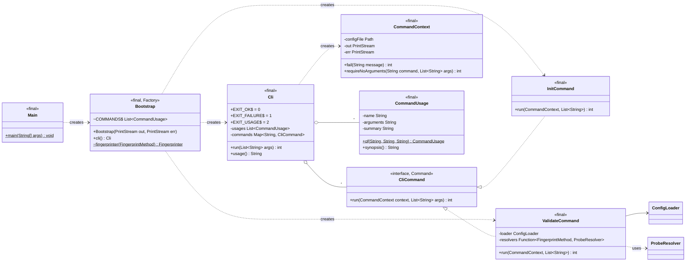
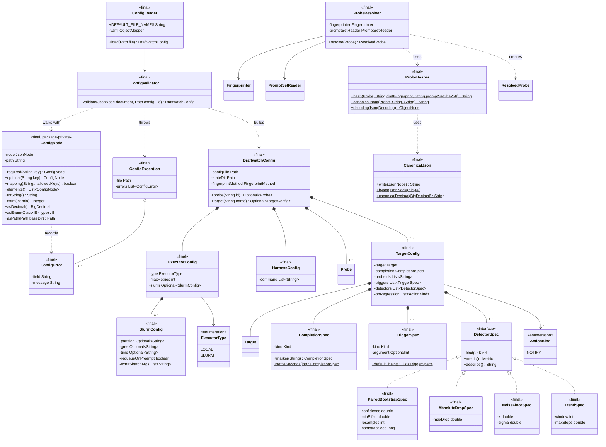
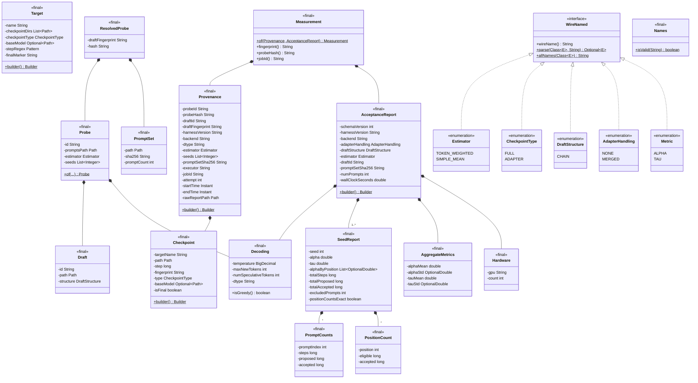
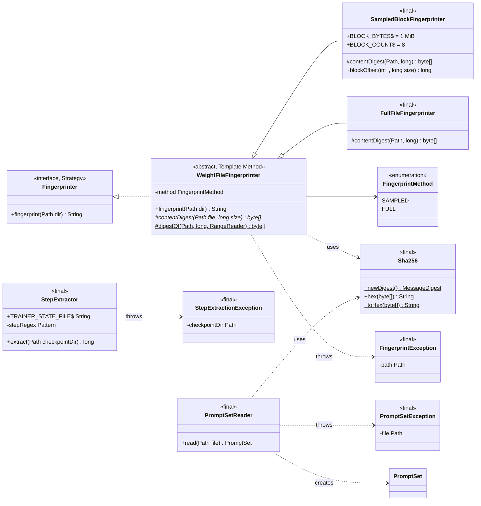

# Class diagram

Updated at the end of every milestone (DECISIONS.md D1). Shows the classes that exist in
`src/main/java` now, not the planned design; for the planned design see `ARCHITECTURE.md`.
Accessors that only return a field are omitted; every domain and config class is immutable
(private final fields, static factory or builder, no setters).

**As of:** M1: domain, config, hashing.

## app: entry point and CLI commands

## config: YAML to validated config, canonical hashing

## domain: immutable domain classes

## fingerprint, discovery, harness: reading checkpoint and prompt files

## Packages

| Package | Populated in |
|---|---|
| `app`, `config`, `domain`, `fingerprint` | M0–M1 |
| `discovery` | M1 (step extraction); M4 (checkpoint sources, completion policies) |
| `harness` | M1 (prompt file reader); M2 (invocation, report parser) |
| `exec`, `store`, `stats` | M2 |
| `detect`, `events`, `notify`, `action` | M3 |
| `trigger` | M4 |
| `report` | M6 |
