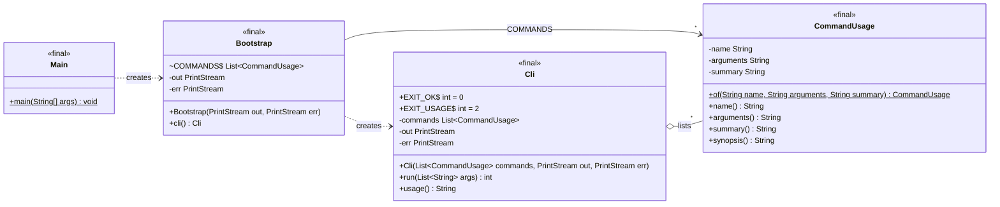

# Class diagram

Updated at the end of every milestone (DECISIONS.md D1). Shows the classes that exist in
`src/main/java` now, not the planned design; for the planned design see `ARCHITECTURE.md`.

**As of:** M0 — Scaffold.

## Packages

Every package below exists with a `package-info.java`. Classes are added milestone by milestone
(`ROADMAP.md`).

| Package | First populated in |
|---|---|
| `app` | M0 |
| `config`, `domain`, `fingerprint` | M1 |
| `discovery`, `trigger` | M1 (step extraction), M4 |
| `exec`, `harness`, `store`, `stats` | M2 |
| `detect`, `events`, `notify`, `action` | M3 |
| `report` | M6 |
